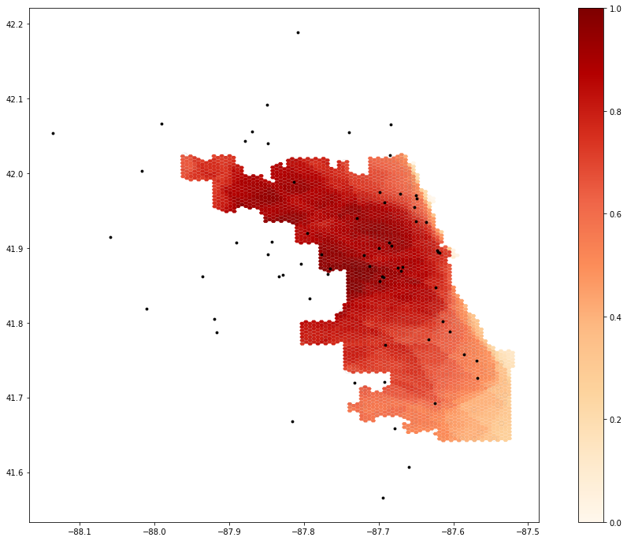

**Replication of**
# Rapidly measuring spatial accessibility of COVID-19 healthcare resources: a case study of Illinois, USA.

Original study *by* Kang, J. Y., A. Michels, F. Lyu, Shaohua Wang, N. Agbodo, V. L. Freeman, and Shaowen Wang. 2020. Rapidly measuring spatial accessibility of COVID-19 healthcare resources: a case study of Illinois, USA.
International Journal of Health Geographics 19 (1):1–17. DOI:10.1186/s12942-020-00229-x.

Replication Author:
Arielle Landau

Replication Materials Available at: [RP-Kang](https://github.com/alandaux/RP-Kang)

Created: `5/20/2021`
Revised: `5/22/2021`

## Introduction

Kang et al. (2020) developed an analysis to determine the spatial accessibility of COVID resources, such as ventilators and ICU beds, in Illionois. They used a two step catchment area method to calculate areas with extensive, or limited service to hospitals. In doing so, Kang et al. (2020) was able to identify areas in Illinois that required more resources, providing important insights for healthcare infrastructure and policy-making.

Kang et al. (2020) is a truly innovative paper in that the methods, in the form of code, were published online using CyberGISX. By doing so, this study takes an important step in the field of Open Source GIScience by allowing anyone with a laptop and internet access to reproduce their study. Testing whether their code and data is both functional and accessible is important in assessing how reproducible Kang et al. (2020) is.

## Materials and methods

Kang et al. (2020) used four datasets:
* hospitals from Illinois Department of Public Health (IDPH) which included data on the number of ICUP beds and ventilators
* COVID-19 confirmed cases - also from the IDPH
* residential data from the United States Census Bureau, 2018 American Community Survey for each census tract in Illinois
* road network data from the OSMnx Python package, which downloads street data from OpenStreetMap

Hospitals that would not supply services to COVID-19 patients, such as psychiatric hospitals, were excluded from the analysis. For their Chicago specific analysis, hospitals within 15 miles outside the buffer zone for Chicago (30 min travel time) were also included. Hospitals outside Illinois were not included in the analysis.

A parallel enhanced two step floating catchment area method was used to calculate a service to population ratio. As Kang et al. (2020) explains succinctly:
    "The method has two major steps: calculating an ICU bed (or ventilator)-to-population ratio for each supply location and then summing these ratios for residential locations where supply regions overlap."

Hospital catchments were calculated as a convex hull. Accessibility results were also summed into a grid of hexagons. Their model also takes into account travel time in 10, 20 and 30 minute zones, with weights of 1, 0.68 and 0.22 respectively.

In the reproduction, an issue in the code published by Kang et al. on CyberGISX was found in relation to the road network. The code only pulled road data from Chicago, and then hospitals were paired to the nearest network node. This meant that for hospitals outside of Chicago, their locations were moved to the nearest network node **inside** Chicago. In order to remedy this, a buffer distance was added to the load and plot network function.
```
#if the path doesnt exist, retrieve that data, else, load the data
if not os.path.exists("data/Chicago_Network_Buffer.graphml"):
    G = ox.graph_from_place('Chicago', network_type='drive', buffer_dist = 25750) # pulling the drive network the first time will take a while
    ox.save_graphml(G, 'Chicago_Network_Buffer.graphml') #ox is OSMNX library, so open street map server for python
else:
    G = ox.load_graphml('Chicago_Network_Buffer.graphml', node_type=str)
ox.plot_graph(G)

```
The buffer_dist parameter is in meters. A value of 25750m, which is about 16 miles, was used as the buffer distance because the methodology of the paper included hospitals within 15 miles of Chicago.

The Kang et al. code on CyberGISX also includes a model where one could theoretically use different inputs, although the default settings are the only ones which are functional at the moment.


## Results and Discussion

Link to the [final repository](https://github.com/alandaux/RP-Kang)



The resulting map shows which areas in Chicago have the most access (1) to areas that have the least access (0) to hospital services for COVID-19. There were 65 total catchment areas calculated, so this map visualizes how those catchments overlap to provide some areas with more services than others.

In reproducing Kang et al. (2020), several uncertainties were found, mostly in the data files provided in the CyberGISX repository. For example, data from the American Community Survey about the number of people in each census tract that were over the age of 50 was given to us as an already calculated field. There is thus no way to know which data fields in the American Community Survey were used to sum the number of people over the age of 50. One suggestion would be to use the Census API in the python code, so that those seeking to reproduce the study know exactly how the number of people over 50 was calculated. Similarly, the hospital data was also in the repository as pre-packaged, so it is unclear which hospitals they excluded from the data as not having COVID services. For the purposes of transparency and reproducibility, additional code and/or metadata should be included in the data sources in the repository.

Additionally, it was unclear how the weights were determined for the 10, 20 and 30 minute travel zones. The paper did not cite previous studies that used these weights, or explained what they were derived from besides the general theory of friction of distance.

## Conclusions

Although there were some minor issues with the code published by Kang et al. (2020), the ability to reproduce this study was very feasible, especially when compared to most other published geospatial papers. The fact that the code is public means we can all work together to improve the analysis, but it also lends credibility to the published results because we can get much closer to understanding what the original authors did. Future research could focus on making different small changes to the analysis to reveal uncertainties within the model, and to also test how robust the model is. Future research could also focus on creating slightly different models for rural vs. urban areas, especially when it comes to the weighting for the 10, 20 and 30 minute travel zones. Similarly, including public transit in the network analysis would also be an area of future research.
