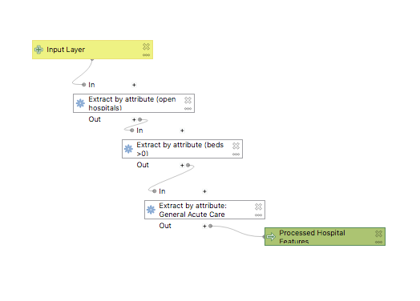

A [gravity model](assets/GravityModel.model3) of spatial interaction model was created for the purpose of
identifying the potential interaction between two places. The model uses
three variables to calculate potential interaction: the weight/attractiveness
of the input, the weight/attractiveness of the target and the distance between
the origin and the target. These three parameters combine to form the
equation: (inputWeight)^λ * (targetWeight)^α / (distance)^β as referenced
in Rodrigues [The Geography of Transport Systems](https://transportgeography.org/contents/methods/spatial-interactions-gravity-model/)

A case study of hospital service areas in New England was used a case study to
investigate the accuracy of the model, as compared to the hospital service areas
determined by the [Dartmouth Atlas of Health Care](https://www.dartmouthatlas.org/).

[Hospital Data](https://hifld-geoplatform.opendata.arcgis.com/datasets/6ac5e325468c4cb9b905f1728d6fbf0f_0)
from the Homeland Security Administration was pre-processed in a [model](assets/HSAPreProcessModel.model3)
that removed closed hospitals and hospitals with no beds, as well as filter out
hospitals that weren't classified as general acute care.

After pre-processing the HSA Hospital Data was put into the gravity model as the
target layer, with beds as the weight field. Town and population data from
the American Community Survey 2018 5 year average was the input layer, with
population as the weight field. The ACS [data](https://gis4dev.github.io/lessons/assets/netown.gpkg)
was put together by Joe Holler.

You find the comparison between my gravity model of spatial interaction for
hospital service areas in New England and the Dartmouth Atlas of Health care
[here](assets/index.html).

Although there are some similarities between the output of my model and the
Dartmouth Atlas of Health Care's geographic boundaries, there is still a lot of
room for the accuracy of my model to be improved. 
