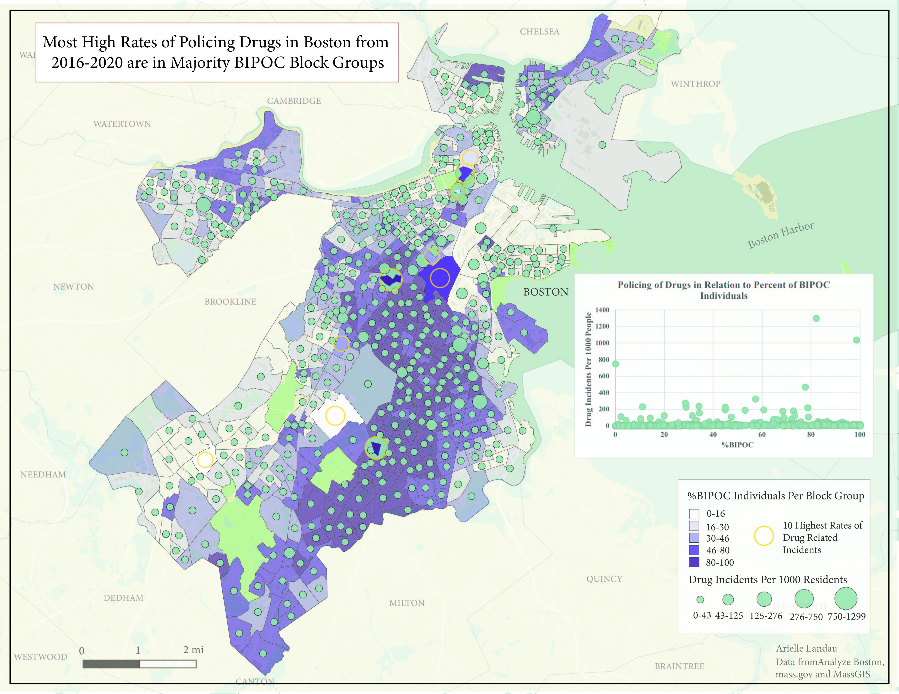
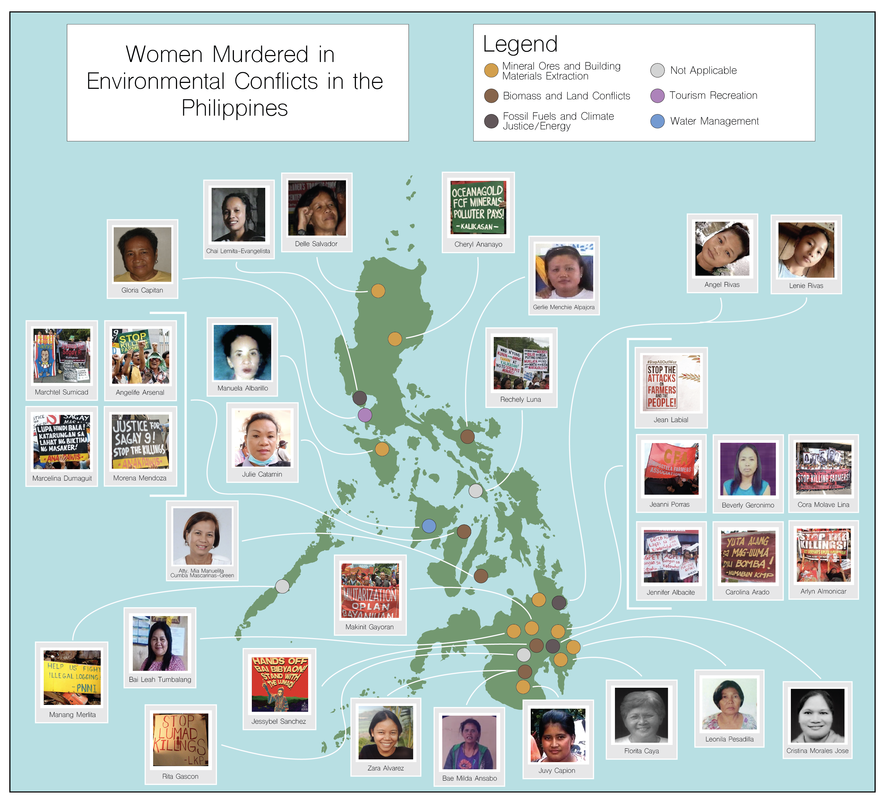

### I studied Environmental Justice and Computer Science at Middlebury College so I could use computer algorithms and Geographic Information Systems (GIS) to advance goals of social and environmental justice. I currently pursue this work at the Environmental Justice Atlas, where I partner with researchers to visualize and analyze data, conduct geospatial analyses and produce elegant, informative maps for various research projects.

## [LinkedIn](https://www.linkedin.com/in/arielle-landau-8374091bb)

## Project Portfolios
- [Cartographic Work for Environmental Justice](assets/EJMapPortfolio2022.pdf)
- Senior Thesis: [A Uniquely Destructive Injustice: US Nuclear Testing on Indigenous Lands - an Environmental Justice and GIS Analysis](assets/A Uniquely Destructive Injustice - Final Draft.pdf)
    - Tldr: After many hours of searching through thousands of pages of declassified documents from the US Atomic Energy Agency, combined with geospatial analysis, this work exposed and visualized the unjust exposure of indigenous people in the Southwest of the US and in the Marshall Islands to radioactive fallout at the hands of the US government.
- [An Environmental Justice Analysis of Protected Areas in Connecticut](Landau_CTEJReport.pdf)
- [Racial Profiling of Drug Related Incidents in Boston, MA](assets/BostonPolicing.md)

- [BIPOC Population's Access to Train Stations in Cambridge and Somerville Massachusetts](assets/camberville.md)
- [Protecting Wading Waterfowl Habitat in Maine's Midcoast Watersheds](assets/WWHMaine.md)
- [Ethical Considerations for Solar Development in Chittenden County, VT](assets/ChittendenSolarEthics.md)

## Publications
- Map featured in [Women Defending Our Earth: Honouring martyred Filipina environmental defenders on International Women’s Day] by Dalena Tran(https://theecologist.org/2022/mar/08/women-defending-our-earth)

- [Nuclear Testing in Newe Segobia, Western Shoshone Lands, Nevada, US](https://ejatlas.org/conflict/nuclear-testing-in-newe-segobia-western-shoshone-lands-in-nevada-us)

## Skills

| Software Development | Programming Languages |
| ------------- | ------------- |
| Node  | Python |
| React.js  | Javascript |
| Next | Java |
| Git | CSS |
| Qt Creator| HTML |
| Test Driven Development  | C++ |
| Agile Development  | SQL |

| Computer Programs | Relevant Course Work |
| ------------- | ------------- |
| QGIS | Software Development |
| ArcGIS | OOP & GUI Development |
| Adobe Illustrator | Open Source GIS Science |
| Tableau | Cartography - Visualizing Our Future |
| R. Studio | Computer Architecture |
| Github Desktop | Data Structures |
| Visual Studio Code | Human Geography with GIS |

## Open Source GIScience Labs
- [Replication of Rapidly measuring spatial accessibility of COVID-19 healthcare resources](RP-Kang/report.md)
- [Analysis of Resilience of Schools to Flooding in Dar es Salaam](DarEsSalaamResilienceAcademy/report.md)
- [Reproduction of Vulnerability Modeling for Sub-Saharan Africa](RP-Malcomb/docs/report/RP-Malcomb-Report.md)
- [Gravity Model of Spatial Interaction](gravity/gravity.md)
- [Spatial-temporal and content analysis of Twitter Data](RE-Dorian/docs/RE-Dorian-Report.md)
- [Rosgen Stream Classification Replication Study](rosgen/rosgenReport.md)
