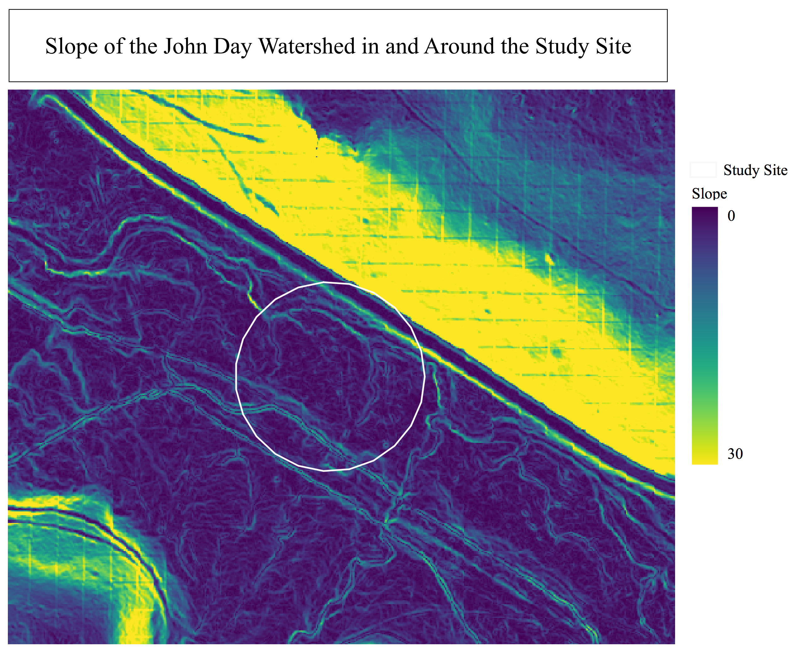
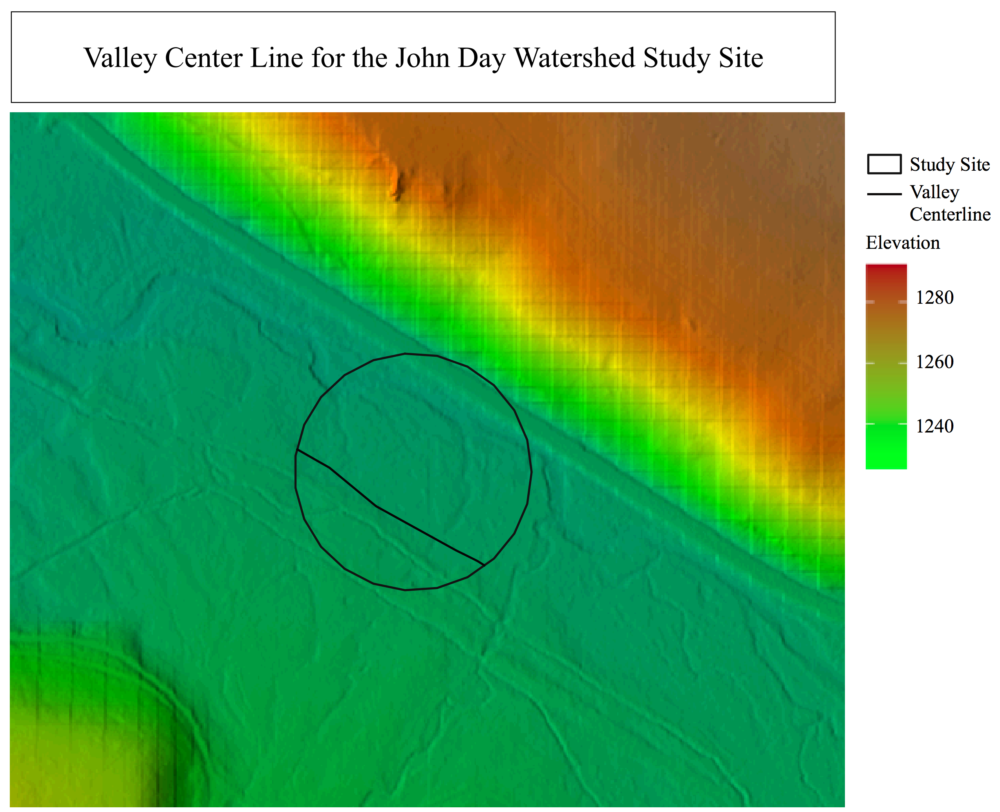
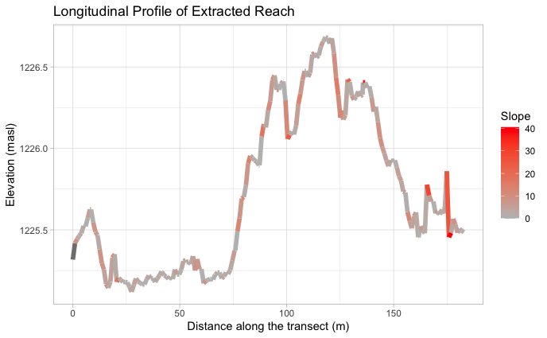
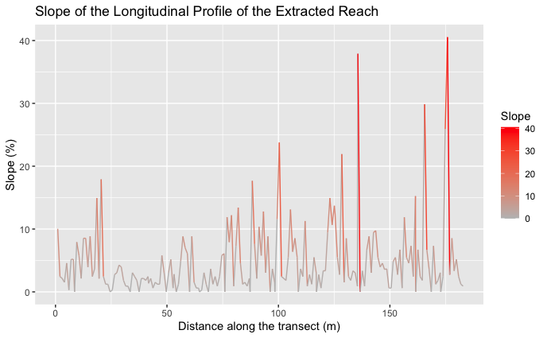
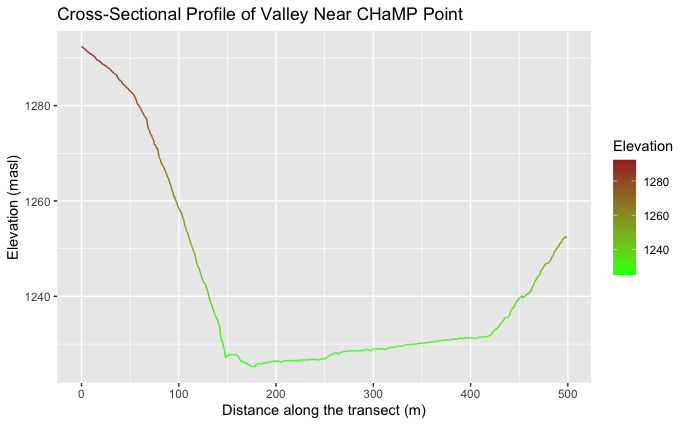
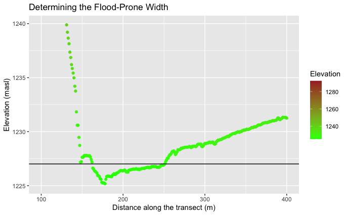

**Replication of**
# A classification of natural rivers

Original study *by* Rosgen, D. L.
*in* *CATENA* 22 (3):169–199. https://linkinghub.elsevier.com/retrieve/pii/0341816294900019.

and Replication by: Kasprak, A., N. Hough-Snee, T. Beechie, N. Bouwes, G. Brierley, R. Camp, K. Fryirs, H. Imaki, M. Jensen, G. O’Brien, D. Rosgen, and J. Wheaton. 2016. The Blurred Line between Form and Process: A Comparison of Stream Channel Classification Frameworks ed. J. A. Jones. *PLOS ONE* 11 (3):e0150293. https://dx.plos.org/10.1371/journal.pone.0150293.

Replication Authors:
Arielle Landau, Zach Hilgendorf, Joseph Holler, and Peter Kedron.

Replication Materials Available at: [RE-Rosgen](https://github.com/alandaux/RE-rosgen)

Created: `17 March 2021`
Revised: `24 March 2021`

## Intro and Motivation

The original study, ***A classification of natural rivers*** by Rosgen, establishes a classification hierarchy with 7 major categories for natural rivers. Rosgen's motivation was to use this classification system to aid river restoration, engineering and infrastructure plans, fish habitat conservation and the management of water resources. Moreover, the classification was produced to advance goals such as predicting the behavior of rivers, extrapolating results from one river to another, exploring the relationship between morphology and hydraulic and sediment relations and providing a consistent system of reproducibility and communication. The classification scheme was derived by comparing 450 different rivers of varying size and origin. The replication study, ***The Blurred Line between Form and Process: A Comparison of Stream Channel Classification Frameworks***, by Kasprak et al., compared four different stream classification techniques, the River Styles Framework, the Natural Channel Classification, the Rosgen classification scheme and channel form based statistical classification, on the same study site of the John Day Watershed. The goal was to identify weaknesses in the models, and specific situations where they were more likely to diverge from one another. Kasprak found that the four frameworks were largely consistent with each other, and when they diverged, the divergence could be attributed to differences in spatial scale, the order of metrics in the frameworks decision tree and whether the framework took into account historic channel form. The goal of our replication is to see if we can reproduce Kasprak's results, using Rosgen's classification scheme, with GIS. In other words, can we make accurate stream classifications without having to actually visit the field site.

### Sampling Plan and Data Description

For our replication, a single stream reach was randomly assigned from the larger set of stream reaches in the John Day Watershed used in the Kasprak et al. study. Other students in the Spring 2021 Open Source GIScience course will be randomly assigned other stream reaches, which is why this replication is only focusing on a single stream reach.

## Materials and Procedure

All code and materials is available in my Rosgen repository [here](https://github.com/alandaux/RE-rosgen)

 **Detailed procedures and protocols** for the analyses conducted in GRASS can be found [here](assets/1-Research_Protocol_GRASS.pdf), while the code for analyses in R. Studio can be found [here](assets/2-ProfileViewer.Rmd), with instructions [here](assets/3-Classifying.pdf).

Models used in GRASS:
* [Center Line Calculations](center_line_length.gxm)
* [Visualization](visualize.gxm)

Differences from the Original Study:
Kasprak et al. used a DEM of 0.1m grid resolution derived from LIDAR data. Our replication used a DEM of 1m grid resolution from John Day Watershed LIDAR data, making digitization of stream banks and valley sides less accurate than it would be with the same data as Kasprak.  

Elaborated Protocol for Digitization:
After visualizing the hillshade, the opacity for the hillshade, DEM and slope were changed in order to gain a view favorable for identifying stream banks and the valley edge for digitization.

Assessment Criteria:
Using the Rosgen classification scheme, our replication will be deemed successful if we reach the same conclusions as Kasprak et al. in their Rosgen analysis of the same stream reach. The goal is to see if we can reproduce results remotely using GIS that Kasprak and Rosgen conducted with (at least some) field research.

The classification scheme we followed:

## Replication Results

Figures:

Figure 1

Figure 2

Figure 3

Figure 4

Figure 5

Figure 6

Figure 7

Figure 8

Table 1. Site Measurements
| Variable                                  | Value   | Source                  |
|-------------------------------------------|---------|-------------------------|
| Bankfull Width                            | 7.0366m | CHaMP                   |
| Bankfull Depth Max                        | 0.9116m | CHaMP                   |
| Bankfull Depth Average                    | 0.345m  | CHaMP                   |
| Valley Width                              | 90m     | cross sectional profile |
| Valley Depth                              | 1.8232m | CHaMP                   |
| Stream/River Length                       | 182.89m | banksLine derived data  |
| Valley Length                             | 139.41m | valleyLine derived data |
| Median Channel Material Particle Diameter | 50      | CHaMP                   | 

Table 2. Rosgen Level I Classification
| Critera             | Value   |
|---------------------|---------|
| Entrenchment Ratio  | 12.79   |
| Width / Depth Ratio | 20.3959 |
| Sinuosity           | 1.31    |
| Level I Stream Type | C       |

Table 3. Rosgen Level II Classification
| Critera              | Value           |
|----------------------|-----------------|
| Slope                | 4.956           |
| Channel Material     | Gravel          |
| Level II Stream Type | C4B, C4, or C4C |

## Unplanned Deviations from the Protocol

In order to install the required add ons in GRASS (v.centerline, v.transect, etc.) on MacOS, XCode Command Line Tools must be installed from the Apple Developers library. Additionally, the XCode Command Line Tools downloaded must be of a version that aligns with the current version of MacOS on one's device. [See this github issue for more details](https://github.com/GIS4DEV/RE-rosgen/issues/2).

The randomly assigned location for this replication, location id 16, had multiple points recorded in the CHaMP data from different years. Attribute values were thus averaged across the three points used in the Kasprak et al. study.

## Discussion
Kasprak et al. determined the study site (location id = 16) to be C for level I classification, and c4b for level II classification. Because the slope calculated in my replication was 4.956 (Figure 2), much higher than the slope range in Rosgen where the highest slope is 0.039, I was unable to further classify the stream site beyond c4b, c5 or c4c for level II classification. However, I was able to replicate Kasprak's results for level I classification (stream type C).

The slope was large because it was calculated as the average of all slopes instead of calculating one slope from start to end. Combined with a less accurate resolution as compared to the Kasprak et al. study, error could easily have been introduced. Kasprak used 0.1m DEM resolution, while we only had access to 1m resolution. When digitizing, error was likely introduced when drawing the stream banks up and down the banks or valley sides, causing the slope to seem steeper than reality.

Atypical streams often do not fit in with established categories, meaning they get more divergent results with different classification schemes. The study site is one of these streams, where in the Kasprak study there was poor agreement between the Rosgen, river styles and statistical clustering. Kasprak attributes these differences in classification because each framework takes into account physical variables at varying levels and at varying points in the classification process. Rosgen's classification scheme is often criticized because of its hierarchical approach, where what determinations come first, and the corresponding thresholds of categorization can seem arbitrary. Kasprak also noted that classification frameworks often disagreed when the channel form was largely different from the valley width. From observations when digitizing the site, the stream banks were minuscule compared to the valley width, likely explaining the disagreement among frameworks the Kasprak recorded (Figure 3 and 4).

## Conclusion

This replication of Rosgen and Kasprak showed that there is potential to use GIS for stream classification, but the accuracy of such classifications require detailed satellite and elevation data. Level I stream classification was consistent between this replication and Kasprak, but the level II classification failed. However, this study site was atypical, so future replications and research should be done on other sites used in Kasprak et al. to see if the difficulty in matching level II classifications continues across all sites. This would help determine whether the results in this study were because of the atypicality of the study site, or because of broader issues with using GIS for stream classification. If lower level classifications are consistent across other, more typical study sites, there is the potential to grow the existing knowledge of rivers remotely, therefore cutting costs for research, while also decreasing the carbon footprint of research that requires travel.

## References

* Kasprak, A., N. Hough-Snee, T. Beechie, N. Bouwes, G. Brierley, R. Camp, K. Fryirs, H. Imaki, M. Jensen, G. O’Brien, D. Rosgen, and J. Wheaton. 2016. The blurred line between form and process: A comparison of stream channel classification frameworks ed. J. A. Jones. PLOS ONE 11 (3):e0150293. https://dx.plos.org/10.1371/journal.pone.0150293.
* Rosgen, D. L. 1994. A classification of natural rivers. CATENA 22 (3):169–199. https://linkinghub.elsevier.com/retrieve/pii/0341816294900019.

####  Report Template References & License

This template was developed by Peter Kedron and Joseph Holler with funding support from HEGS-2049837. This template is an adaptation of the ReScience Article Template Developed by N.P Rougier, released under a GPL version 3 license and available here: https://github.com/ReScience/template. Copyright © Nicolas Rougier and coauthors. It also draws inspiration from the pre-registration protocol of the Open Science Framework and the replication studies of Camerer et al. (2016, 2018). See https://osf.io/pfdyw/ and https://osf.io/bzm54/

Camerer, C. F., A. Dreber, E. Forsell, T.-H. Ho, J. Huber, M. Johannesson, M. Kirchler, J. Almenberg, A. Altmejd, T. Chan, E. Heikensten, F. Holzmeister, T. Imai, S. Isaksson, G. Nave, T. Pfeiffer, M. Razen, and H. Wu. 2016. Evaluating replicability of laboratory experiments in economics. Science 351 (6280):1433–1436. https://www.sciencemag.org/lookup/doi/10.1126/science.aaf0918.

Camerer, C. F., A. Dreber, F. Holzmeister, T.-H. Ho, J. Huber, M. Johannesson, M. Kirchler, G. Nave, B. A. Nosek, T. Pfeiffer, A. Altmejd, N. Buttrick, T. Chan, Y. Chen, E. Forsell, A. Gampa, E. Heikensten, L. Hummer, T. Imai, S. Isaksson, D. Manfredi, J. Rose, E.-J. Wagenmakers, and H. Wu. 2018. Evaluating the replicability of social science experiments in Nature and Science between 2010 and 2015. Nature Human Behaviour 2 (9):637–644. http://www.nature.com/articles/s41562-018-0399-z.
